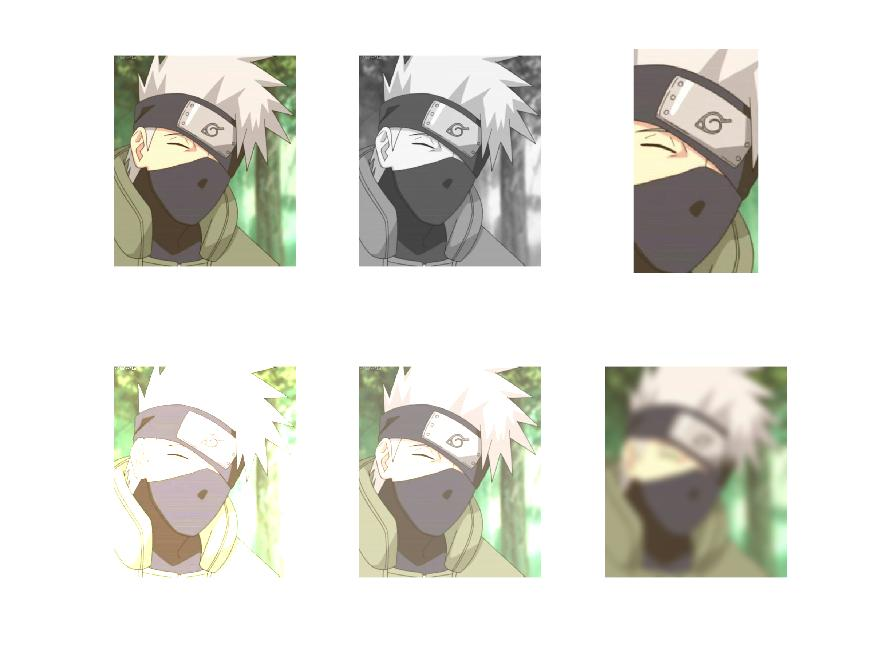

# This is written document for lab1. 
`Yiyang Wang`

## exercise 1 : 
* e1.m  
 vectorize the for loop and compare the time  
 Vectorized code runs faster because it doesnt contains loops, and it has shorter lines.

* e2.m  hi.jpg  
some basic image processing: gray scale, get user click, 
contrast and brightness images, blur the image  
`run: click space once a image shows. for the pop out figure, select a region`  

## exercise 2: 
* ex2.m  
fwdSubst.m  bwdSubst.m  elimMat.m  myLU.m  test_ex2.m  

using backward,forward subsitution and LU method to solve system 

## exercise 3: 
* ex3a.m
* ex3b.m
* ex3c.m . 
char_c1.mat
mri_c1.mat
  transfer data into image

		
		
## Q&A
* ex2.4  
Given a matrix A and b, we first do LU factorization. We call emimMat to get M1 M2 m2 .. and L1L2l3... And then we get L and U. We use forward subsitituion to get y, Lb = y. regard y as new b, use backward subsititution to get x by Ux =b. we solved x finally. 

* 3a.  
The overdetermined system is better because it used more equations to
  % make data more precise. 
  
