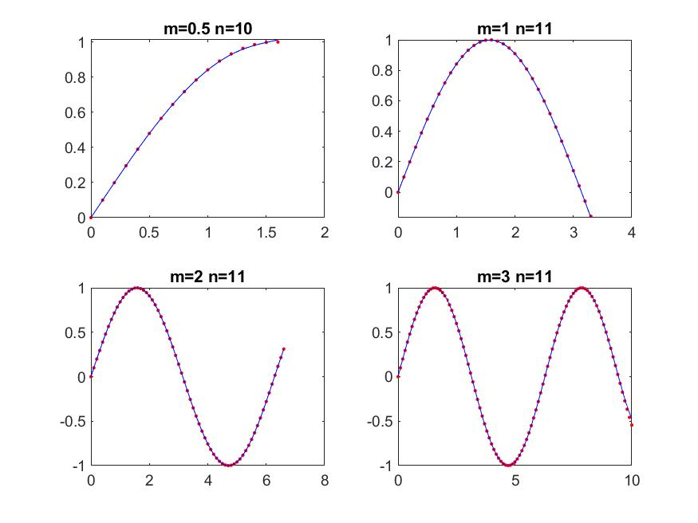
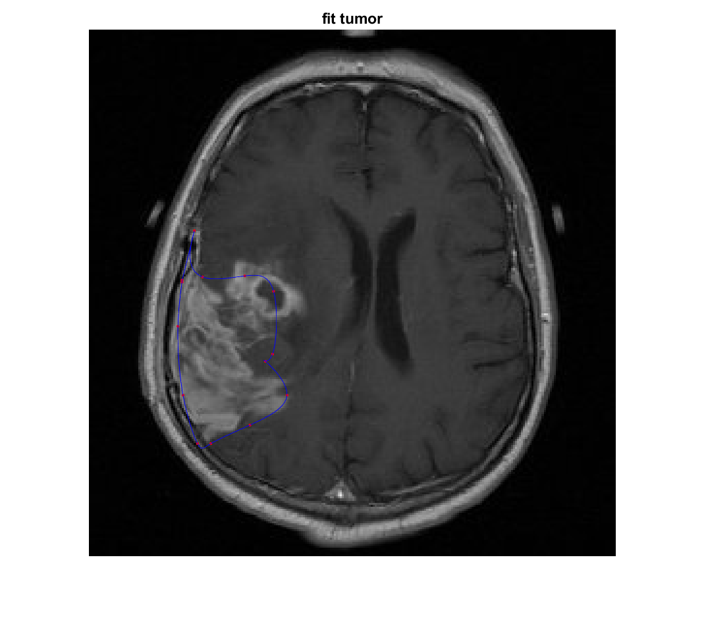

# This is written document for lab1. cmput340

`Yiyang Wang`

## exercise 1 : 
* ex1.m

## Q&A
What degrees polynomial "fits" reasonably each of the cases m=0.5, 1, 2, 3 above?  
n = 10, 11, 11, 11 respectively.

How does the polynomial compare with the true sin function?
Inbetween sample points?
They are similar.

Outside the samples interval? (note the "2^(1/n)" in X_new =(0:0.1:2^(1/n)*m*pi)' )
They are not quite similar.

## for exercise 2:
* ex2.m
  tumor.jpg 
  tumorContour.jpg
  polinomialContour.jpg

